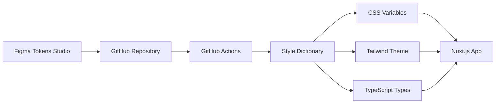

# Tokens Studio + GitHub Actions + Style Dictionary Workflow

이 프로젝트는 **Tokens Studio for Figma** → **GitHub Actions** → **Style Dictionary** → **Tailwind CSS v4** 워크플로우를 구현합니다.

## 🎨 Design Tokens 워크플로우

### 1. Figma에서 토큰 생성
- Figma에서 **Tokens Studio** 플러그인 사용
- GitHub 연동으로 `tokens/` 폴더에 JSON 파일 저장

### 2. 자동 빌드 프로세스


### 3. 생성되는 파일들
- `assets/css/design-tokens.css` - CSS 변수
- `assets/css/theme-tokens.css` - Tailwind v4 @theme 설정
- `composables/useDesignTokens.ts` - TypeScript 인터페이스

## 🚀 GitHub Actions 워크플로우

### 📋 워크플로우 목록

1. **Build Design Tokens** (`.github/workflows/build-tokens.yml`)
   - 토큰 변경 시 자동 실행
   - Style Dictionary로 CSS/TS 파일 생성
   - 자동 커밋 및 푸시

2. **Validate Design Tokens** (`.github/workflows/validate-tokens.yml`)
   - PR 생성 시 토큰 검증
   - JSON 문법 확인
   - 필수 속성 검증

3. **Build and Deploy** (`.github/workflows/deploy.yml`)
   - main 브랜치 푸시 시 실행
   - Nuxt.js 애플리케이션 빌드
   - GitHub Pages 배포 (선택사항)

## 📁 프로젝트 구조

```
figma_mcp/
├── tokens/                    # Design Tokens (JSON)
│   └── global.json
├── assets/css/               # 생성된 CSS 파일들
│   ├── design-tokens.css
│   ├── theme-tokens.css
│   └── main.css
├── composables/              # 생성된 TypeScript 파일들
│   └── useDesignTokens.ts
├── .github/workflows/        # GitHub Actions
│   ├── build-tokens.yml
│   ├── validate-tokens.yml
│   └── deploy.yml
└── style-dictionary.config.js
```

## 🛠️ 로컬 개발 명령어

```bash
# 패키지 설치
npm install

# 디자인 토큰 빌드
npm run tokens:build

# 토큰 변경 감지 및 자동 빌드
npm run tokens:watch

# 개발 서버 시작
npm run dev

# 프로덕션 빌드
npm run build
```

## 🎯 사용 방법

### 1. Figma에서 토큰 수정
1. Figma에서 Tokens Studio 플러그인 열기
2. 토큰 값 수정
3. "Push to GitHub" 클릭

### 2. 자동 프로세스
1. GitHub Actions가 자동으로 실행
2. Style Dictionary가 CSS/TS 파일 생성
3. 변경사항 자동 커밋
4. Nuxt.js에서 새로운 토큰 사용 가능

### 3. 코드에서 토큰 사용

#### CSS에서 사용
```css
.my-component {
  color: var(--colors-primary-500);
  padding: var(--spacing-md);
}
```

#### Tailwind 클래스로 사용
```html
<div class="bg-primary-500 p-md">
  <!-- Tailwind v4 theme에서 자동 생성된 클래스 -->
</div>
```

#### TypeScript에서 사용
```typescript
import { tokens } from '~/composables/useDesignTokens'

const primaryColor = tokens['colors-primary-500']
```

## ⚙️ 설정 파일

### Style Dictionary 설정
`style-dictionary.config.js`에서 출력 형식 설정:
- CSS Variables 형식
- Tailwind v4 @theme 형식
- TypeScript 인터페이스 형식

### Tailwind CSS v4 설정
`assets/css/main.css`에서 테마 설정:
```css
@import "tailwindcss";
@import './design-tokens.css';
@import './theme-tokens.css';

@theme {
  /* 추가 커스텀 테마 변수 */
}
```

## 🔧 트러블슈팅

### 토큰 빌드 오류
```bash
# 토큰 파일 구문 확인
node -c "JSON.parse(require('fs').readFileSync('tokens/global.json', 'utf8'))"

# 캐시 클리어 후 재빌드
rm -rf node_modules/.cache
npm run tokens:build
```

### GitHub Actions 권한 오류
1. Repository Settings → Actions → General
2. "Workflow permissions"를 "Read and write permissions"로 설정

## 📄 라이선스

MIT License